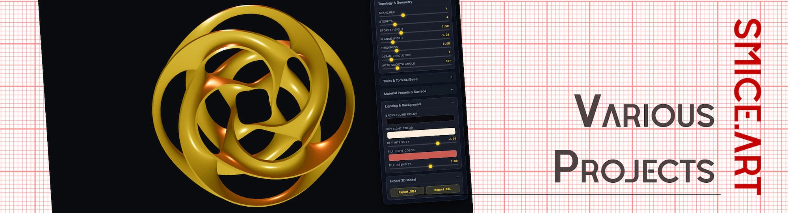
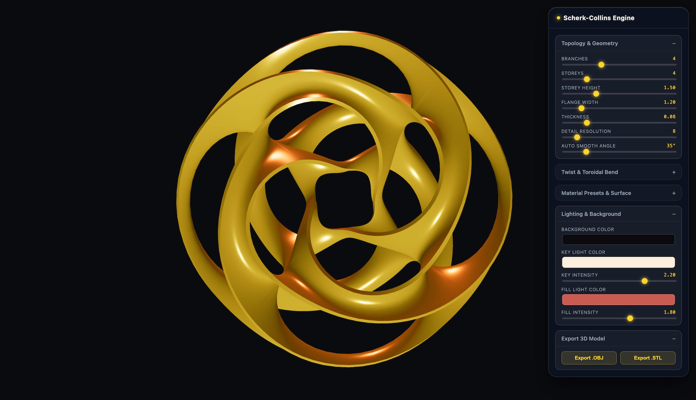
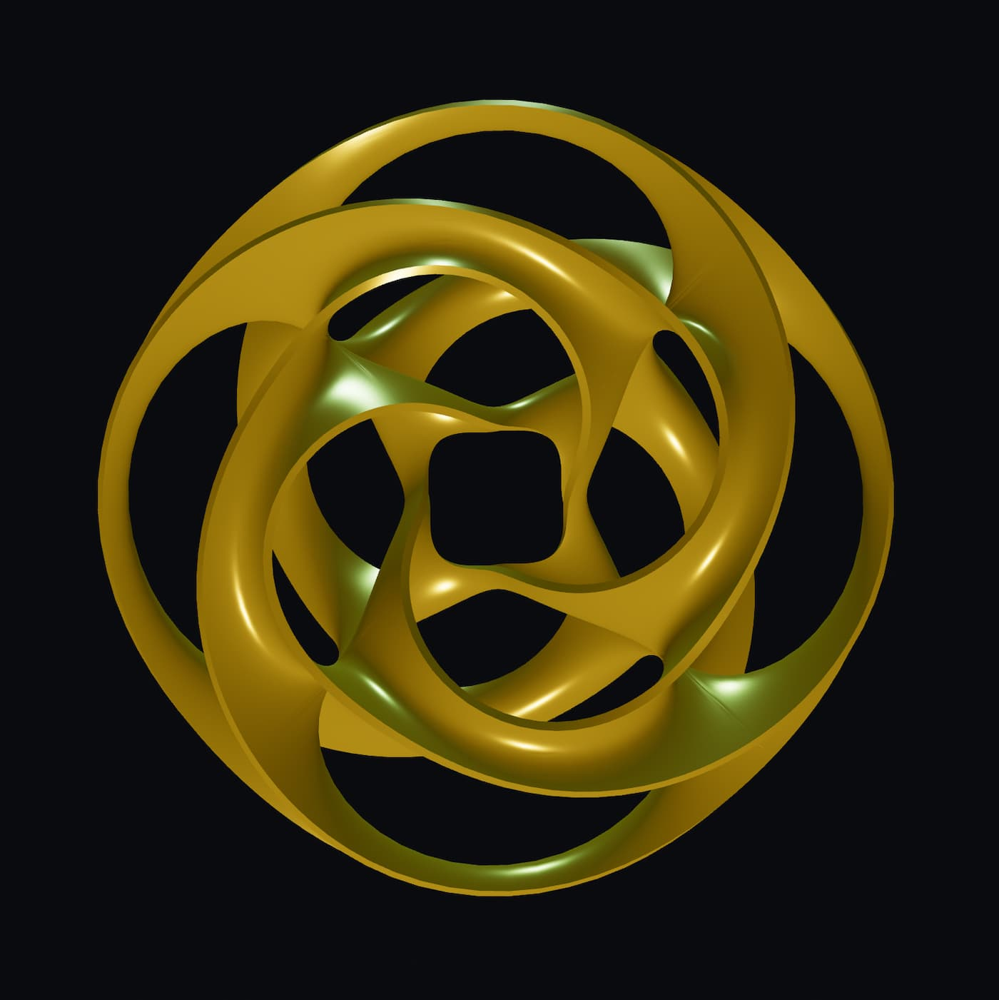
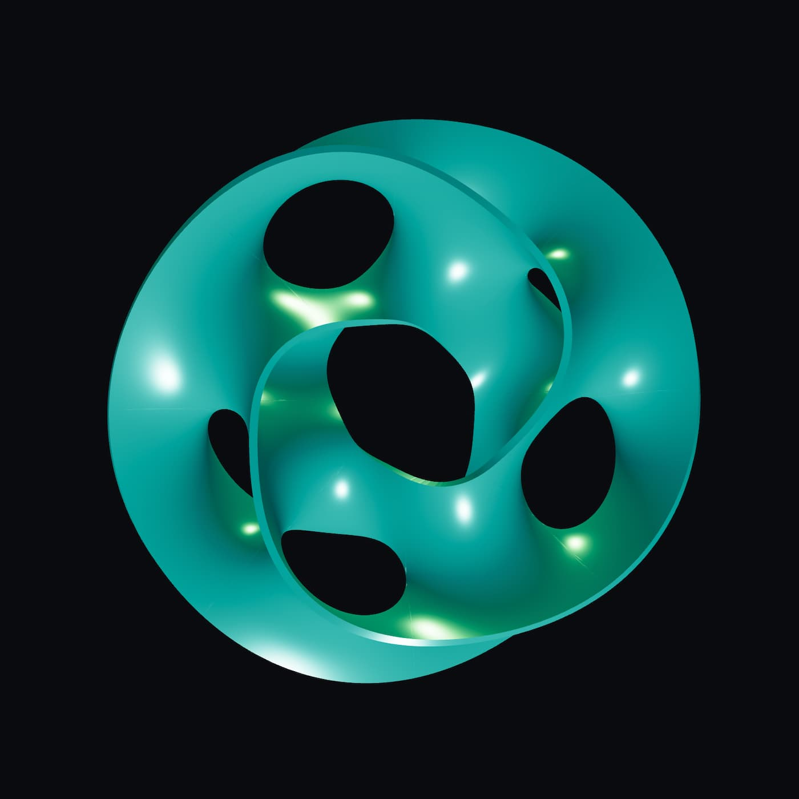

  

# Info ⚠️
Please excuse me regarding the correct mathematical terms; I am unfortunately not a mathematician, so they are sometimes certainly not correct. 

# Scherk, Scherk Collin Surface Generator
The original idea was to build a "generator" based on the Scherk-Collin surface generator. Despite using Qwen, Claude.ai, ChatGpt, and Gemini, I haven't been able to perfectly reproduce it for Blender. So I tried another way in HTML & Three.js.
Here is the result so far, one thing I did not get solved is the tiny gap between the branches. 

## Key Features
* You have many slider to adjust the Objects parameter.
* You can export objects in stl or obj

## Screen Shot & LIVE Version (click to visit and ignore, if asked for redirection)

## Run
Just click the "Screenshot or download the *.html file from this repository.

## Views
| Image | Previews | 
| :--- | :--- |
|  | Gemini Smooth 1 |
|  | Gemini Smooth 2 |

## Release Notes

### v1.0.0 (September 12, 2026)
- **Publishing**: First public upload of Web Engine.
